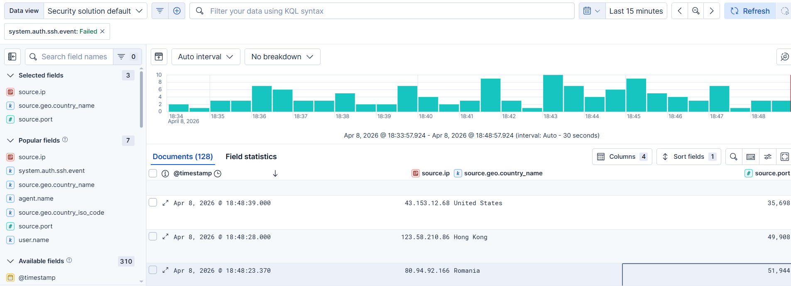
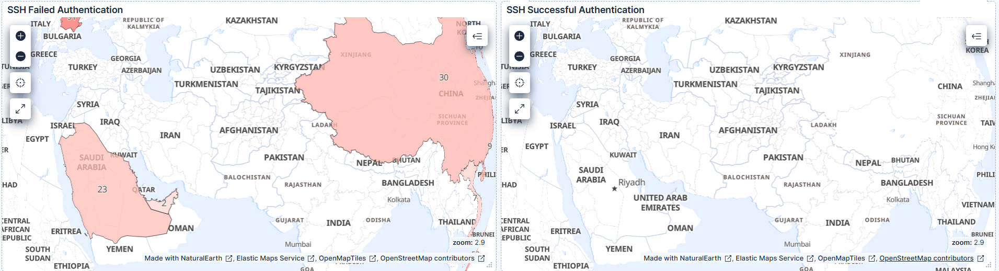
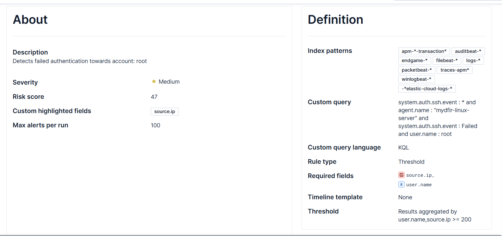

# SOC Home Lab (MyDFIR Challenge)

## Architecture Diagram
Attacker Machine → Target System (Windows/Linux with Sysmon/Audit Logs) → Log Forwarder (Filebeat / Splunk UF) → ELK Stack (Elasticsearch + Logstash + Kibana) → SIEM Dashboard → Alert Detection & Analysis

## Setup Steps
1. Deployed a cloud-based SOC lab using Vultr instances.  
2. Configured ELK Stack (Elasticsearch, Logstash, Kibana) for centralized logging.  
3. Installed Sysmon on Windows endpoints for detailed event logging.  
4. Configured Filebeat to forward logs to Logstash.  
5. Parsed and indexed logs into Elasticsearch.  
6. Created dashboards in Kibana for visualization and monitoring.  
7. Simulated attacks (brute force, suspicious commands) to generate logs.  

## Sample Logs
### Failed Login Attempt (Linux SSH)
Apr 8, 2026 @ 18:32:46.642 | source.ip: 80.94.92.167 | country: Romania | destination.port: 41254 
Apr 8, 2026 @ 18:32:43.000 | source.ip: 2.57.121.118 | country: Romania | destination.port: 9736 
Apr 8, 2026 @ 18:32:40.408 | source.ip: 118.70.178.158 | country: Vietnam | destination.port: 34270.

## Detection Rules

### Suspicious IP Activity (KQL - Kibana)

Trigger condition:
- Multiple connection attempts from foreign IPs within short time window
- Unusual high/random destination ports

## Screenshots

### Kibana Logs View

### Dashboard

### Alerts

Analysis:
Observed repeated inbound connections from foreign IP addresses (Romania, Vietnam) targeting uncommon ports, indicating potential scanning or brute-force activity.
